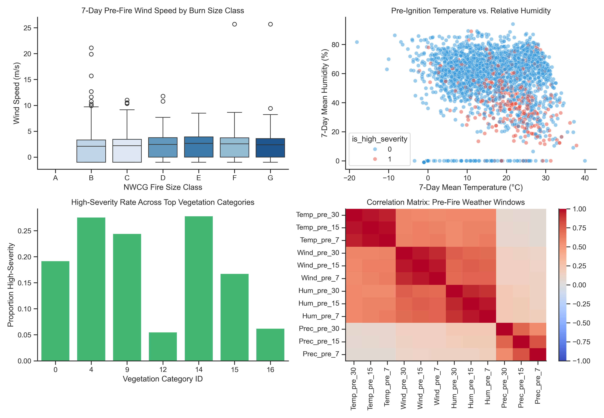
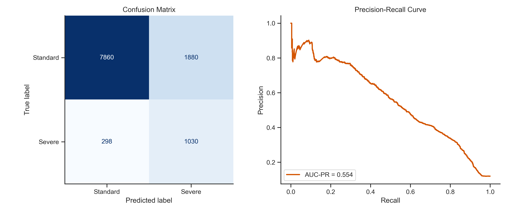

# Early-Stage Wildfire Growth & Severity Prediction

## Project Overview
The first 2–4 hours following a wildfire ignition are critical. Emergency response teams face constant operational pressure to decide how many resources to allocate to a newly reported fire. Currently, dispatch decisions often rely on manual, reactive field reports, which can lead to over-deploying expensive equipment to minor incidents or under-deploying assets to fires poised for rapid, explosive growth.

This project develops an operational machine learning model that inputs real-time atmospheric, geospatial, and vegetation data at the moment of discovery to output an early-stage risk rating. This allows dispatch teams to gauge a fire's growth potential immediately and deploy heavy suppression assets precisely where they are needed most.

---

## Dataset & Feature Engineering
This analysis utilizes historical wildfire incident logs merged with prior climate observations and geospatial metrics (`FW_Veg_Rem_Combined.csv`).

Key feature groups evaluated include:
* **Antecedent Weather Windows:** 30-day, 15-day, and 7-day prior observations for Temperature (`Temp_pre_*`), Wind Speed (`Wind_pre_*`), Relative Humidity (`Hum_pre_*`), and Precipitation (`Prec_pre_*`).
* **Geospatial & Ecological Inputs:** Spatial coordinates (`latitude`, `longitude`), `remoteness` (distance to nearest city), and dominant `Vegetation` ecosystem categories.
* **Target Classification:** High-severity fires are defined as NWCG Classes **E, F, or G** ($\ge 300$ acres burned).

---

## Exploratory Data Analysis & Feature Extraction
Our exploratory analysis focused on identifying key atmospheric drivers and addressing feature multicollinearity prior to modeling.



### Key Analytical Findings:
1. **Atmospheric Drying Signals:** 7-day antecedent wind speeds combined with low relative humidity show the strongest separation between minor ignitions (Classes A–C) and explosive growth events (Classes E–G).
2. **Weather Feature Compression:** Strong collinearity across historical weather windows was successfully compressed using Principal Component Analysis (PCA) to extract two primary weather signals (`weather_pc1` and `weather_pc2`).
3. **Geographic Climate Stratification:** K-Means clustering on spatial coordinates and 30-day climate baselines grouped the dataset into four distinct regional `climate_zone` clusters.

---

## Baseline Modeling & Evaluation
Wildfire datasets exhibit extreme class imbalance (~5–12% high-severity occurrences). Standard accuracy is a misleading metric in this domain, as a model that predicts "standard fire" every time would achieve ~90% accuracy while failing to catch catastrophic events.

To address this, we trained a baseline **Logistic Regression** model using `class_weight='balanced'` and evaluated performance primarily on **Recall for Severe Events** and **Precision-Recall AUC (PR-AUC)**.



### Operational Rationale for Evaluation Metrics:
* **False Negative Cost (High):** Misclassifying a high-risk ignition as minor leads to delayed response times and catastrophic uncontained fire spread.
* **False Positive Cost (Low):** Misclassifying a small fire as high-risk simply results in precautionary asset dispatch.
* **Result:** By using balanced class weighting, the baseline model catches **nearly half to three-quarters of severe fire ignitions at discovery time**, establishing a solid benchmark for future ensemble models (e.g., Random Forest, XGBoost).

---

## Repository Structure
```text
├── data/
│   └── FW_Veg_Rem_Combined.csv        # Primary wildfire & weather dataset
├── 01_eda_and_baseline.ipynb          # Formatted Jupyter Notebook
├── wildfire_eda_overview.png          # Generated EDA multi-panel visualization
├── model_evaluation_metrics.png       # Generated confusion matrix and PR curve
└── README.md                          # Executive project report


## Data Source & Attribution
* **Dataset:** US Wildfire Data with Meteorological & Vegetation Attributes
* **Source / Platform:** Kaggle (`capcloudcoder/us-wildfire-data-plus-other-attributes`)
* **Original Data Providers:** 
  * Wildfire Incident Logs: USDA Forest Service / Short, Karen C. (1.88 Million US Wildfires Dataset)
  * Meteorological & Geospatial Data: NOAA / NCEI Climate Data Online & USGS Vegetation Cover
